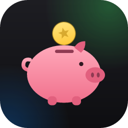
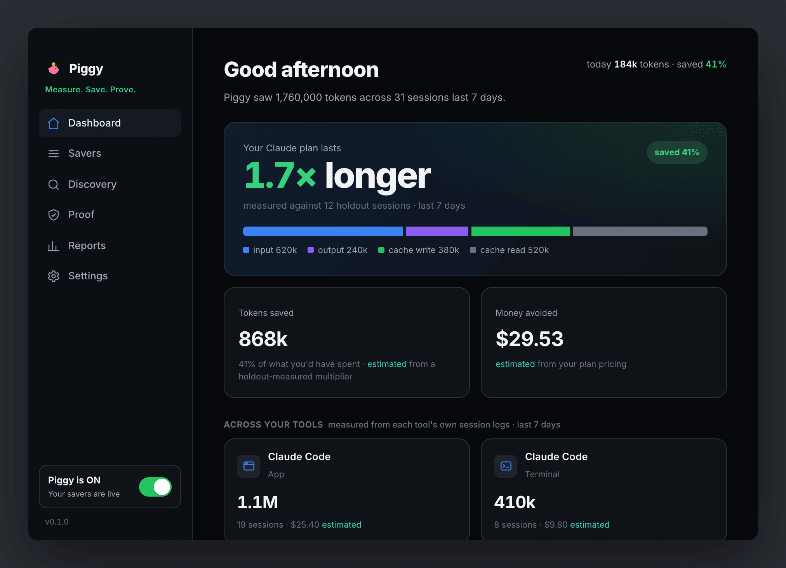
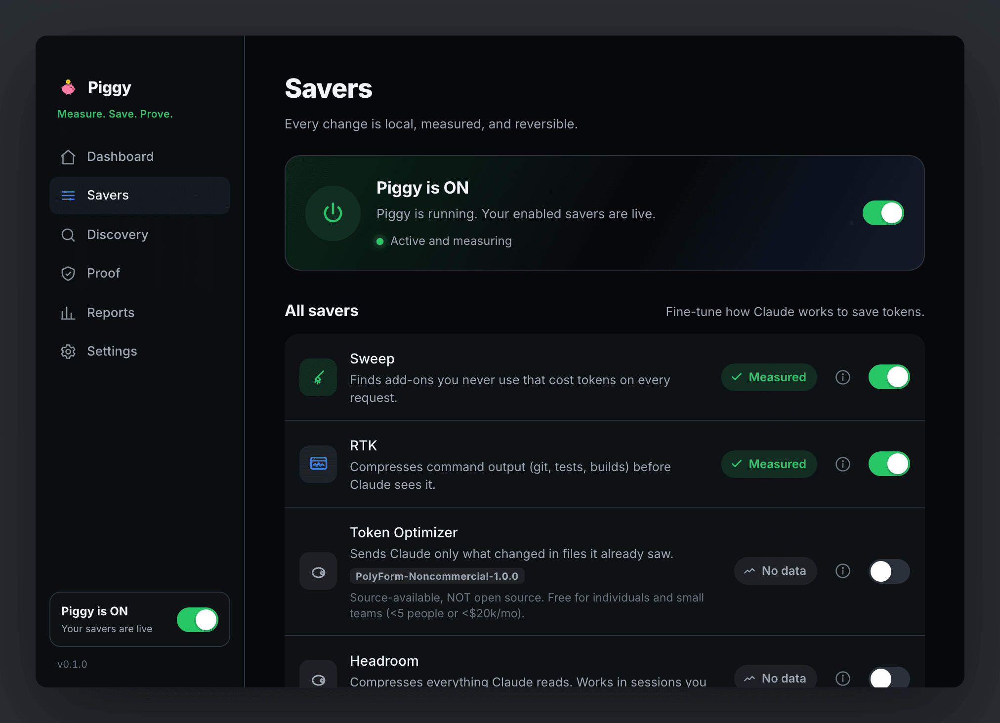
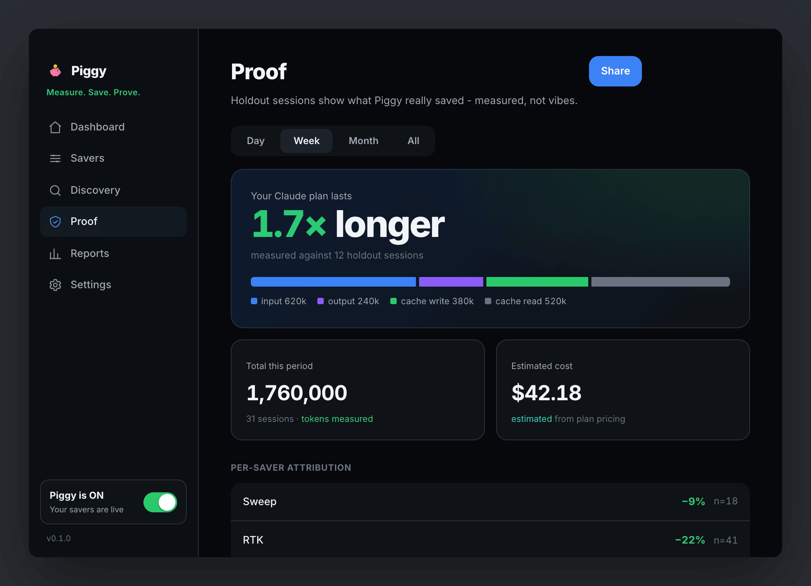
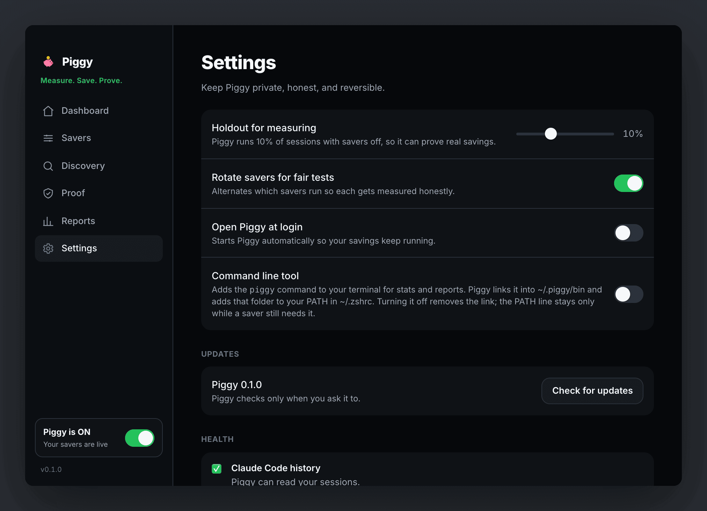
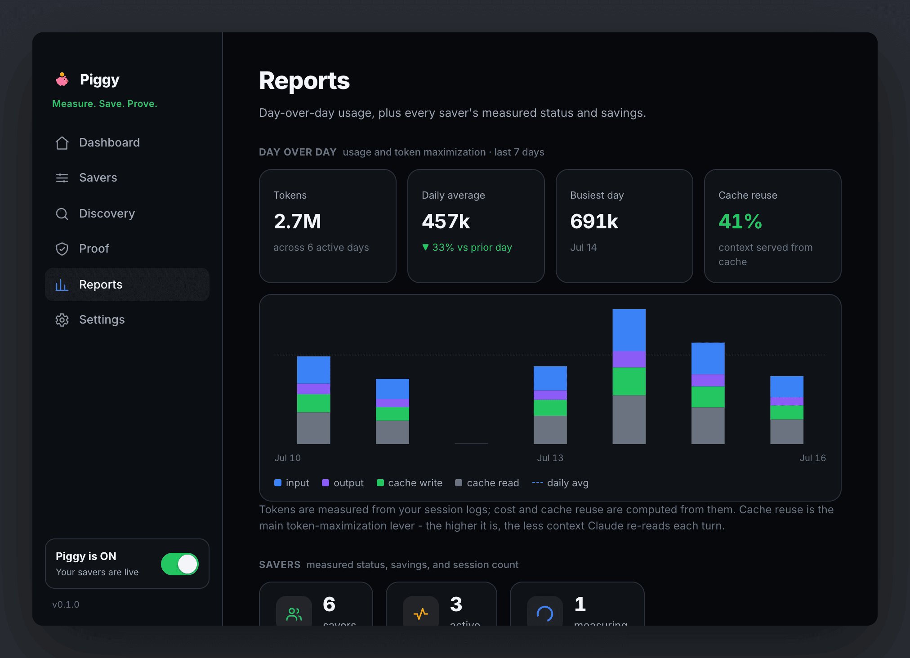
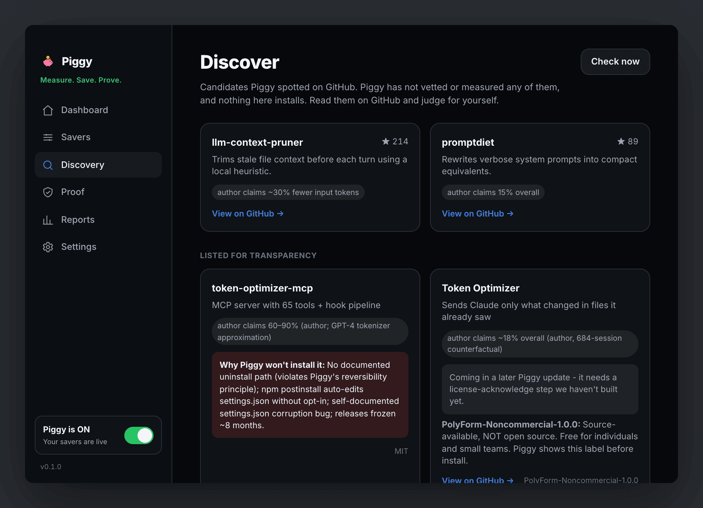

<p align="center">
  
</p>

<h1 align="center">🐷 Piggy</h1>

<p align="center"><strong>Your Claude plan, but longer.</strong></p>

<p align="center"><em>The App Store - and the referee - for Claude Code token savers.</em></p>

<p align="center">
  
  
  
  
</p>

Piggy is a free, open-source macOS menu bar app for Claude Code users who keep hitting usage
limits. It installs the best community token savers with one toggle - no terminal, no config
files - and then does something nobody else does: **it measures whether they actually work.**

> [!WARNING]
> **Not released yet.** There is no published build to download. `npx piggybank` and the `.dmg`
> link further down do not work, because the first signed build has not shipped. Everything
> below describes an app you cannot install today. See [Status](#status).

<p align="center">
  
</p>

<sub>The Dashboard. The **1.7x** is measured against holdout sessions. The two tiles below it are
*estimated*, and the app says so on both: `Tokens saved` reads *estimated from a holdout-measured
multiplier*, `Money avoided` reads *estimated from your plan pricing*.</sub>

> **About the screenshots.** They are the real UI running on sample fixtures, captured from the
> app's mock mode (`npm run dev:mock`), never from a real install. Every number in them is seeded
> demo data. They show what Piggy displays and how it labels things; they are not anyone's
> measured results, and no saver's savings should be inferred from them.

## How it works

1. **Flip the switch.** Piggy installs a curated set of token savers in the right order,
   backing up your Claude settings first. Everything is reversible with one click.
2. **Keep coding like always.** Piggy reads Claude Code's own session logs to count every
   token - input, output, cache - straight from the source.
3. **See honest numbers.** A small share of sessions run with savers off (a *holdout*), so
   Piggy can show you *measured* savings, not marketing claims:
   `−22% measured` beats `60–90% claimed` every day.

<p align="center">
  
</p>

<sub>**Savers.** Plain English, and an honest badge. Sweep and RTK are *Measured*. Token Optimizer
and Headroom say *No data*, because there is no data. A license that is not open source is named on
the row, before you touch the toggle.</sub>

## Honesty rules

- **measured** numbers come from your real session logs, compared against holdout sessions.
- **estimated** numbers involve a pricing table or a projection, and are always labeled.
- The two are never blended. If there isn't enough data, Piggy says *"measuring"*. It never
  shows a number it can't back.
- Saver authors' own claims appear only on install cards, labeled *claimed*.

Those rules aren't a promise in a README. They're the labels on the controls. The Proof tab is
where they all land at once:

<p align="center">
  
</p>

Three things in that screenshot are the whole product:

- **`−9%` and `−22%`, each with an `n=`.** Per-saver deltas against your holdout sessions, with the
  sample size attached, so you can see how much session data each number rests on.
- **`tokens measured` sitting beside `estimated from plan pricing`.** Two tiles, two labels, never
  blended. Tokens are counted from your logs. Cost always involves a pricing table, so cost is
  always estimated, and always says so.
- **`measured against 12 holdout sessions`.** The headline carries its own denominator.

## Privacy

No telemetry. No accounts. Your usage data never leaves your Mac. Piggy reads Claude Code's
session logs under `~/.claude`, and Codex's under `~/.codex` if you have it. Both read-only,
and the numbers stay local.

Piggy's own network calls all go to GitHub: downloading official saver releases, listing
newly discovered tools, and checking for its own updates when you press the button in
Settings. The saver catalog is built into the app rather than fetched, so catalog changes
reach you with app updates.

Turning a saver on is the one exception, and it's worth stating plainly: Piggy runs that
saver's official installer, which fetches from that saver's own home rather than from GitHub.
Headroom comes from PyPI, into an isolated venv; the plugin savers come from the Claude
plugin marketplace, fetched by your own `claude` binary. Normal, and pinned to a known
version, but it isn't Piggy talking to GitHub. Separately, once Headroom is on,
`piggy-claude` runs your session through its local proxy, which relays to Anthropic the same
way plain `claude` already does.

## Install

> [!WARNING]
> **Still not released.** Nothing in this section works yet. See [Status](#status).

```
npx piggybank        # downloads and opens the notarized app
```

or grab the latest `.dmg` from [Releases](../../releases).

Command-line fans get a standalone CLI too. It ships inside the app: turn on **Command line
tool** in Settings and Piggy links `piggy` onto your PATH, via `~/.piggy/bin` and one managed
block in `~/.zshrc`. Turning it off always removes the link. The `~/.zshrc` block goes too,
unless a saver you still have on keeps a binary in `~/.piggy/bin` - Headroom's `piggy-claude`
is the usual reason it stays.

```
piggy stats          # today / week / month token totals, per project and model
piggy doctor         # checks your setup and Piggy's own health
```

`piggy --help` lists the rest (`report`, `install`, `sweep`, `restore-defaults`, and more).
Working from a clone instead? `cargo build --release -p piggy-cli` puts it in
`target/release/piggy`.

<details>
<summary>Two more screens: <b>Settings</b> (the holdout dial and the CLI toggle above) and <b>Reports</b> (usage over time)</summary>
<br>
<p align="center">
  
</p>

<sub>**Settings.** The holdout share is a dial you own. Rotation alternates which savers run so each
one gets attributed fairly. The **Command line tool** toggle is the `piggy` link described above.
Updates are checked only when you press the button.</sub>

<p align="center">
  
</p>

<sub>**Reports.** Usage over time, per stream. In the app's own words: *"Tokens are measured from
your session logs; cost and cache reuse are computed from them."*</sub>
</details>

## Run Claude through Piggy

Most savers work in every session automatically. The deepest one, Headroom, is scoped on
purpose: it compresses only the sessions you start with `piggy-claude`, a launcher Piggy
adds when you turn Headroom on.

```
piggy-claude    # Claude Code with deep compression
claude          # plain Claude Code, untouched
```

Use `piggy-claude` wherever you'd normally run `claude`. If anything ever misbehaves, plain
`claude` keeps working exactly as before - nothing about your normal setup changes.

Consistency matters for the numbers: while Headroom is on, Piggy counts your sessions as
compressor-on sessions. Launching plain `claude` with the toggle on waters down your measured
savings, so pick the wrapper and stick with it.

## For saver authors

Piggy never forks or vendors your code. It installs from wherever you already publish (GitHub
release artifacts, PyPI, the Claude plugin marketplace) and pins a known-good version. Where
you ship a checksums file alongside a GitHub release, Piggy verifies the download against it.
Want your tool listed? Open a PR against `registry/catalog.json`. Honest measurement is
applied equally to everyone.

<p align="center">
  
</p>

<sub>**Discover.** Candidates Piggy spotted on GitHub. In the app's own words: *"Piggy has not vetted
or measured any of them, and nothing here installs."* Authors' figures stay labeled *author claims*.
The **Listed for transparency** section is the part worth reading: when Piggy won't install
something, it names the rules the tool broke rather than quietly leaving it out, and when the
holdup is Piggy's own unfinished work it says that instead.</sub>

## Status

All four milestones built and tested: ✅ measurement core · ✅ install engine · ✅ holdout
measurement · ✅ menu bar app (139 Rust + 26 UI + 30 installer tests, run locally - this repo has
no CI). Not yet released: the first .dmg needs the signing/notarization steps in
[docs/releasing.md](docs/releasing.md), which require an Apple Developer ID certificate. See
[DESIGN.md](DESIGN.md).

## License

[MIT](LICENSE)
